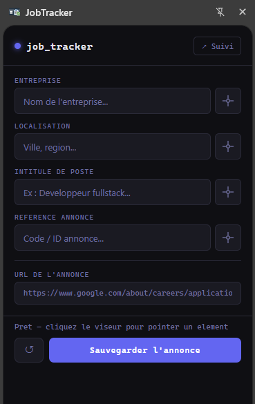
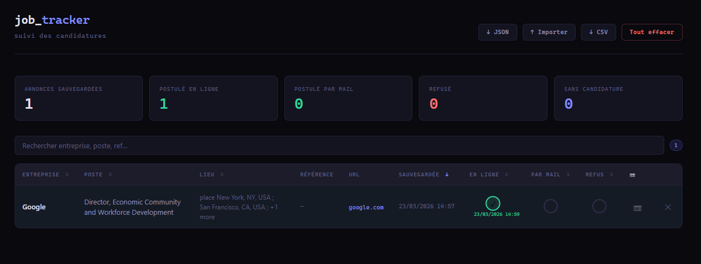
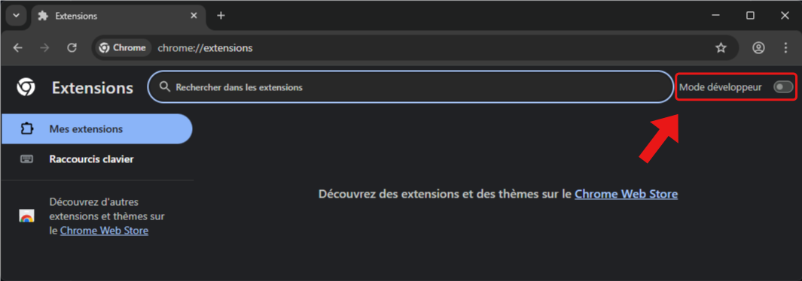

# JobTracker

[](LICENSE)
[](../../releases)

Extension Chrome/Edge/Brave pour sauvegarder et suivre ses candidatures directement depuis les pages d'annonces d'emploi.

> **Usage personnel** — non publiée sur le Web Store en raison de la permission `debugger` nécessaire pour la capture de pages. Installation via le mode développeur. Merci de citer la source en cas de réutilisation (licence MIT).

---

## Aperçu

Le side panel s'ouvre à côté de la page d'annonce et reste visible pendant toute la navigation. Pointez les éléments sur la page pour remplir les champs automatiquement, sauvegardez — et l'extension archive une copie complète de la page. Le tableau de bord centralise toutes vos candidatures, leurs statuts et les captures archivées.

---

## Fonctionnalités

**Sauvegarder une annonce**
- Side panel persistent — reste ouvert pendant la navigation, se met à jour à chaque changement de page
- Sélection visuelle des champs : cliquez le viseur puis pointez l'élément sur la page
- Remplissage manuel en fallback pour tout champ absent de la page
- URL de l'onglet récupérée et mise à jour automatiquement
- Tooltip au survol du champ URL pour voir l'adresse complète
- Capture MHTML automatique à la sauvegarde : snapshot fidèle avec CSS, images, fonts et icônes inlinés, consultable hors ligne même si l'annonce est retirée



**Suivre ses candidatures**
- Tableau triable sur toutes les colonnes
- 3 colonnes de statut avec date automatique au clic : En ligne / Par mail / Refus
- Tri avancé sur les colonnes de statut : oui d'abord, puis par date décroissante
- Bouton 📷 pour ouvrir le snapshot de la page hors ligne
- Compteurs : total, postulé en ligne, par mail, refusé, sans candidature
- Recherche filtrante sur entreprise, poste, référence, localisation
- Export CSV et export/import JSON complet (snapshots inclus) pour migration entre machines



**Alertes sur les pages d'annonces**
- Bannière verte si vous avez déjà postulé à une annonce, avec les dates
- Bannière rouge si vous avez reçu un refus
- Détection intelligente par patterns d'URL — fonctionne même quand seul le paramètre change (navigation SPA)
- Se met à jour sans rechargement de page

**Confidentialité des données**
- Stockage 100% local : `chrome.storage.local` pour les métadonnées, IndexedDB pour les snapshots
- Aucune donnée transmise à un serveur externe — pas de telemetry, pas d'analytics, pas de connexion à l'installation
- Les seules requêtes réseau effectuées sont les fetches de ressources (CSS, images, fonts) du site visité au moment d'une sauvegarde explicite, pour constituer le snapshot hors ligne
- Export/import JSON avec snapshots pour migrer entre machines ou faire des sauvegardes

---

## Installation

**1. Télécharger**

Rendez-vous sur la page [Releases](../../releases) et téléchargez `jobtracker-extension.zip`. Dézippez l'archive.

**2. Activer le mode développeur**

- **Edge** : `edge://extensions/` → toggle **Mode développeur**
- **Chrome** : `chrome://extensions/` → toggle **Mode développeur**
- **Brave** : `brave://extensions/` → toggle **Mode développeur**



**3. Charger l'extension**

Cliquez **"Charger l'extension non empaquetée"** et sélectionnez le dossier `jobtracker-extension`.

**4. Ouvrir le panneau**

Cliquez l'icône JobTracker dans la barre d'outils pour ouvrir le side panel.

---

## Utilisation rapide

### Sauvegarder une annonce

1. Naviguez vers la page de l'annonce
2. Ouvrez le side panel
3. Cliquez le **viseur** à côté d'un champ, puis cliquez l'élément correspondant sur la page
4. Cliquez **Sauvegarder l'annonce** — le snapshot est capturé automatiquement

### Suivre les candidatures

Cliquez **↗ Suivi** dans le side panel. Cochez **En ligne**, **Par mail** ou **Refus** — la date s'enregistre au clic. Le bouton 📷 ouvre le snapshot hors ligne.

### Migrer vers une autre machine

Dans le tableau : **↓ JSON** exporte tout (annonces + snapshots). Sur la nouvelle machine : **↑ Importer** → mode Fusionner ou Remplacer.

---

## Permissions

| Permission | Utilisation |
|---|---|
| `storage` | Sauvegarde locale des candidatures et snapshots |
| `tabs` | Lecture et suivi de l'URL de l'onglet actif |
| `activeTab` | Accès à la page courante pour la sélection visuelle |
| `scripting` | Injection du content script |
| `sidePanel` | Affichage du panneau latéral |
| `debugger` | Capture MHTML via `Page.captureSnapshot` |

> La permission `debugger` provoque l'affichage du bandeau **"Une extension contrôle ce navigateur"** pendant 1-2 secondes à chaque sauvegarde. C'est inhérent à cette API et la raison pour laquelle l'extension n'est pas publiée sur le Web Store.

---

## Structure des fichiers

```
jobtracker-extension/
├── manifest.json                    # Configuration Manifest V3
├── background.js                    # Service worker : storage, capture MHTML, fetch ressources
├── content.js                       # Injecté dans les pages : sélection visuelle, alertes
├── content.css                      # Styles du highlight de sélection
├── popup.html / popup.js            # Interface du side panel
├── dashboard.html / dashboard.js    # Tableau de suivi des candidatures
├── snapshot-viewer.html / .js       # Lecteur de snapshots
├── welcome.html / welcome.js        # Page de bienvenue à l'installation
├── mhtml2html.js                    # Décodeur MHTML local (fallback)
└── snapshot-db.js                   # Wrapper IndexedDB
```

---

## Recommandation de sécurité

L'extension demande un accès à tous les onglets ouverts. Il est conseillé de créer un **profil dédié** dans votre navigateur, réservé à la recherche d'emploi et à l'utilisation de cette extension. En cas de compromission, ce compartimentage limite l'exposition de vos autres données de navigation.

---

## Limitations connues

- Le bandeau "Une extension contrôle ce navigateur" s'affiche brièvement à chaque sauvegarde
- La capture peut échouer sur les pages système (`edge://`, `about:`, etc.) et sur certaines pages avec des ressources fortement protégées par CORS
- Non testée exhaustivement sur toutes les plateformes d'annonces — les retours via Issues sont bienvenus

---

## Licence

[MIT](LICENSE) — libre utilisation, modification et redistribution avec mention de la source.
